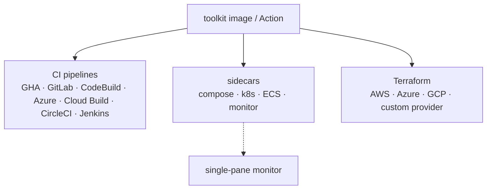

# Disassembly.AI — Integration Examples

Copy-paste examples for running the **[Disassembly.AI](https://github.com/Disassembly-AI)** LLM pentest
toolkit in real environments. Public and MIT-licensed — fork what you need.

<!-- DIAGRAM -->
## What's here

<!-- /DIAGRAM -->

> The engine ships as a container (`ghcr.io/disassembly-ai/toolkit`) and a GitHub Action.
> These examples show how to *invoke* it.

## What the toolkit does
`disassembly scan <target> --ci` plans, executes, and verifies a pentest against a target, then
writes **SARIF 2.1.0** (uploadable to GitHub / GitLab code scanning) plus a Markdown report. It's
billed by tokens + runs, so you set `DISASSEMBLY_API_KEY` and go.

```bash
disassembly scan https://staging.example.com --ci > report.sarif
```

## The matrix

| Pattern | Where | Example |
|---|---|---|
| **CI pipeline** | GitHub Actions | [`.github/workflows/scan.yml`](.github/workflows/scan.yml) |
| | GitLab CI | [`ci/gitlab/.gitlab-ci.yml`](ci/gitlab/.gitlab-ci.yml) |
| | AWS CodeBuild | [`ci/aws-codebuild/buildspec.yml`](ci/aws-codebuild/buildspec.yml) |
| | Azure Pipelines | [`ci/azure-pipelines/azure-pipelines.yml`](ci/azure-pipelines/azure-pipelines.yml) |
| | Google Cloud Build | [`ci/gcp-cloudbuild/cloudbuild.yaml`](ci/gcp-cloudbuild/cloudbuild.yaml) |
| | CircleCI | [`ci/circleci/config.yml`](ci/circleci/config.yml) |
| | Jenkins | [`ci/jenkins/Jenkinsfile`](ci/jenkins/Jenkinsfile) |
| **Sidecar** | Docker Compose | [`sidecar/docker-compose/`](sidecar/docker-compose/) |
| | Kubernetes (sidecar + CronJob) | [`sidecar/kubernetes/`](sidecar/kubernetes/) |
| | AWS ECS (task sidecar) | [`sidecar/ecs/`](sidecar/ecs/) |
| **Terraform** | AWS (scheduled Fargate scan) | [`terraform/aws/`](terraform/aws/) |
| | Azure (Container Instances) | [`terraform/azure/`](terraform/azure/) |
| | GCP (Cloud Run job + Scheduler) | [`terraform/gcp/`](terraform/gcp/) |
| | Reusable module | [`terraform/modules/disassembly-scan/`](terraform/modules/disassembly-scan/) |
| **Custom TF provider** | `disassembly_scan` resource (Go) | [`terraform-provider/`](terraform-provider/) |
| **Monitoring sidecar** | streams telemetry to the single-pane view | [`monitor-sidecar/`](monitor-sidecar/) |
| **Build runners** | one runner image, all CI envs | [`runners/`](runners/) |
| **Realtime architecture** | single-pane design (sidecar → SSE/WS → dashboards) | [`MONITORING.md`](MONITORING.md) |
| **Quickstart** | CLI + Python library | [`quickstart/`](quickstart/) |

## Conventions used everywhere
- **Image:** `ghcr.io/disassembly-ai/toolkit:latest` (also on Docker Hub as `disassemblyai/toolkit`).
- **Auth:** `DISASSEMBLY_API_KEY` — always from the platform's secret store, **never** hard-coded.
- **Target:** `TARGET` env / pipeline input — only ever scan systems you are **authorized** to test.
- **Output:** SARIF to `report.sarif`, uploaded to your platform's code-scanning surface.

## ⚠️ Authorized use only
These examples run offensive-security actions. Only point them at assets you own or are explicitly
contracted to test. Keep the scope allow-list and consent gates in place.

<!-- RELATED -->
## Related

Part of the **[Disassembly-AI](https://github.com/Disassembly-AI)** org.

- 🌐 **Website & pricing:** https://disassembly.ai
- 🏠 **Org landing page:** https://github.com/Disassembly-AI
- 📦 **These examples:** https://github.com/Disassembly-AI/disassembly-examples
<!-- /RELATED -->
